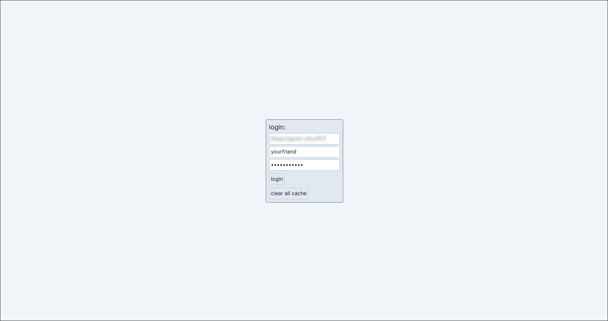
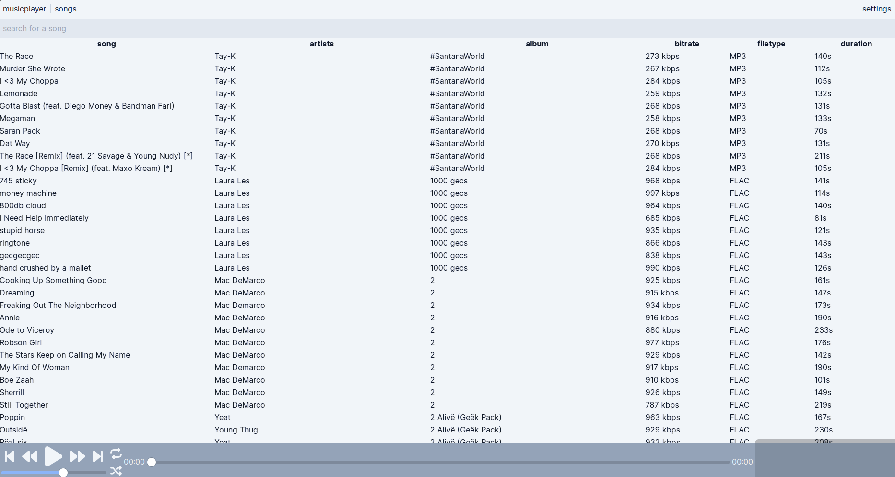
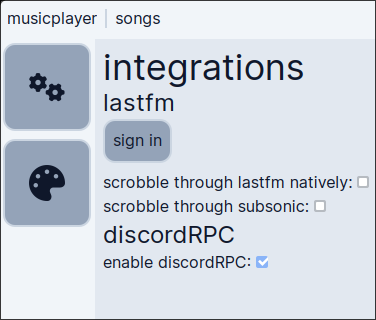
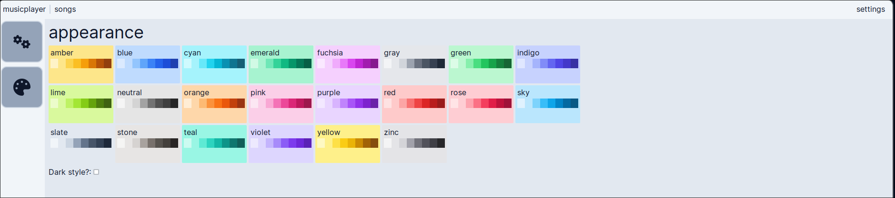
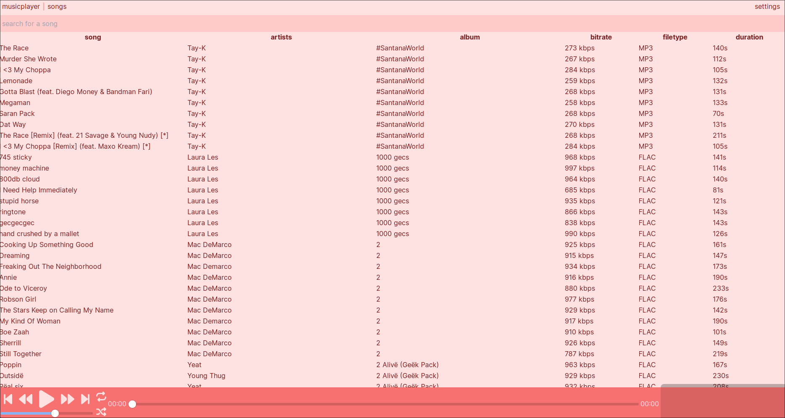
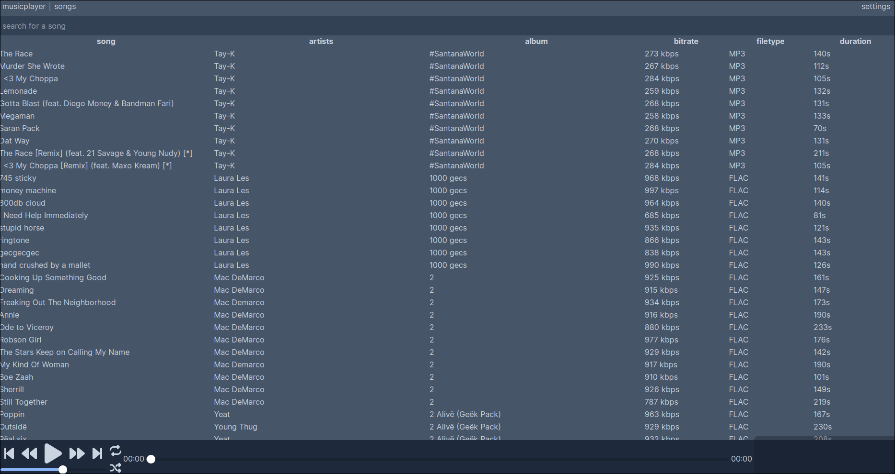

An semi-complciated music player written in React and Tailwind, using Tauri for cross-platform.

Supports:
1. Full LastFM compatability
2. **ONLY** Subsonic is supported. Local file support might come eventually, but don't count on it.
3. Most of Subsonic API.
4. DiscordRPC support

## To build
Just run `npm i`, then `npm run tauri dev`. You must have rust & cargo installed, webkitGTK and whatnot else.  
Check the [tauri V2 docs](https://next--tauri.netlify.app/next/guides/building/) for more information on building.

## Screenshots
### Pages

### Appearance

#### Themes

